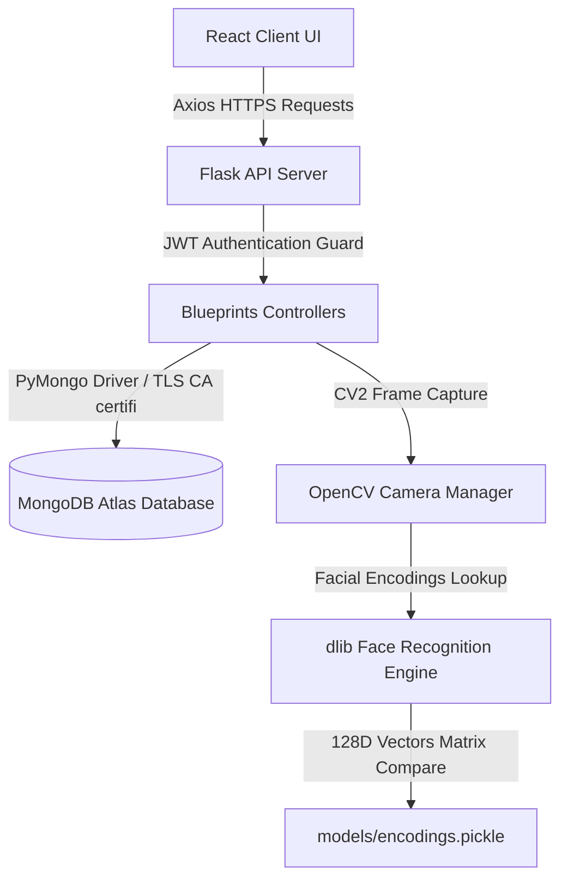

# AI Smart Attendance System

An end-to-end, commercial-grade AI-powered facial recognition attendance system featuring secure role-based portals, automated face registration, live subject-wise session management, and real-time student analytics. Powered by MongoDB Atlas and an optimized OpenCV/dlib computer vision pipeline.

---

## 🚀 Key Features & Highlights

### 🔐 1. Role-Based Authentication & Middleware Guards
- Separate portal endpoints for **Professors** and **Students**.
- API paths are guarded by custom Flask decorators verifying JWT Bearer Tokens (`token_required`) and role accesses (`role_required("professor")`), fully preventing unauthorized access.

### 📸 2. Automated Face Registration & Pose Guidance
- **Hands-Free Capture**: No manual clicks required per image. Captures exactly 20 high-quality face samples sequentially.
- **Micro-Pose Feedback**: Auto-detects facial features to guide students: *"Look Straight"*, *"Turn Left"*, *"Turn Right"*, or *"Tilt Head Up"*.
- **Smart Quality Control**: Pauses automatically if face is lost, multiple faces appear in the frame, or images are too blurry.

### 🏫 3. Live Subject-Wise Scanning Rooms
- Faculty can start live sessions bound to a specific **Subject**, **Department**, and **Semester**.
- Restricts check-ins to enrolled students matching the selected department/semester criteria.
- Real-time video preview draws face markers, shows confidence rates, and triggers immediate client-side toasts.

### 💻 4. Cloud Simulation Mode (Render Fallback)
- **Automatic Telemetry**: Checks for hardware cameras (`cv2.VideoCapture(0)`). If missing (e.g. running on cloud environments like Render), it starts a simulated scanning stream showing grid scan lines, tracking box brackets, and cycling check-ins.
- **Mock Auto-Capture & Training**: Generates programmatically drawn mock face frames for headless registration, mapping deterministic 128D vectors so retraining executes with zero failures on VMs.

### 📤 5. Manual Group Photo Upload Recognition
- Drag-and-drop tab panel inside the scanning room allowing professors to upload a classroom photo.
- The server processes the photo, extracts face landmarks, runs matching logic, blocks duplicates, and commits check-ins to MongoDB Atlas.

### 📊 6. Interactive Analytics & Student Dashboards
- **Weekly & Monthly Trend Visualizations**: Integrated Recharts graphs plotting weekly Present vs. Absent curves and monthly average rates.
- **AI Smart Insights**: Automated metrics detailing peak check-in time windows, low-attendance alert watchlists, and monthly growth averages.
- **Eligibility Index Tracker**: Real-time progress bars indicating classes attended, classes missed, and lectures remaining to meet the 75% exam eligibility threshold.

---

## 🌐 System Architecture



---

## 🛠️ Technology Stack

| Component | Technologies Used |
|---|---|
| **Frontend** | React 19, Vite, TanStack Router, Recharts, Framer Motion, Axios, Tailwind CSS |
| **Backend** | Python 3.11, Flask, OpenCV (Headless), dlib, face_recognition, Gunicorn, openpyxl |
| **Database** | MongoDB Atlas (Cloud Document Store) |
| **Security** | JWT (JSON Web Tokens), bcrypt Password Hashing, CORS Domain Whitelisting |

---

## 📋 API Documentation

All request and response bodies use standardized JSON formats:
```json
{
  "success": true,
  "message": "Operation description details",
  "data": {}
}
```

### 🔐 Auth Endpoints
#### `POST /login`
- **Description**: Authenticate a faculty member or student.
- **Request Body**:
  ```json
  {
    "email": "faculty@gec.edu",
    "password": "securepassword",
    "role": "professor"
  }
  ```
- **Response Data**:
  ```json
  {
    "success": true,
    "message": "Login successful",
    "data": {
      "token": "eyJhbGciOi...",
      "user": {
        "email": "faculty@gec.edu",
        "name": "Professor Sharma",
        "role": "professor"
      }
    }
  }
  ```

### 👤 Student Endpoints
#### `POST /register-student`
- **Description**: Register a new student profile in the database.
- **Request Body**:
  ```json
  {
    "name": "Namrata Dakhole",
    "roll_no": "CS21001",
    "email": "namrata@gec.edu",
    "password": "studentpassword",
    "department": "Computer Science & Engineering",
    "semester": "7"
  }
  ```

#### `POST /auto-capture-sample`
- **Description**: Upload a webcam frame base64 string to register a face image sample (requires 20 total samples).
- **Request Body**:
  ```json
  {
    "name": "Namrata Dakhole",
    "image": "data:image/jpeg;base64,/9j/4AAQSkZJRg..."
  }
  ```

### 🏫 Attendance Endpoints
#### `POST /attendance/start-session`
- **Description**: Open camera streaming and bind check-ins to a subject curriculum.
- **Headers**: `Authorization: Bearer <token>`
- **Request Body**:
  ```json
  {
    "subject_id": 101,
    "department": "Computer Science & Engineering",
    "semester": "7"
  }
  ```

#### `POST /recognize-upload`
- **Description**: Run face recognition on an uploaded classroom group photo.
- **Headers**: `Authorization: Bearer <token>`
- **Multipart Form Data**:
  - `image`: Binary file (image)
  - `subject_id`: 101
  - `department`: "Computer Science & Engineering"
  - `semester`: "7"

---

## 💻 Environment Variables Configuration

Create a `.env` file inside `face_attendance_system/backend/`:

```env
# Server Configs
FLASK_ENV=development
PORT=5000

# Security Configuration
JWT_SECRET=your-super-secret-signing-key
CORS_ORIGIN=http://localhost:5173

# Database Connection (MongoDB Atlas)
MONGODB_URI=mongodb+srv://<username>:<password>@cluster0.zjzw1bz.mongodb.net/smart_attendance?retryWrites=true&w=majority
```

---

## 🚀 Deployment Instructions

### 1. Deploying the Backend on Render (Web Service)
Render containers run in a headless Linux environment. If no hardware camera is present, the server automatically boots in **Cloud Simulation Mode**, yielding an active simulated stream and processing manual photo uploads.

- **Root Directory**: `face_attendance_system`
- **Python Version**: `3.11.9` (auto-configured via `runtime.txt`)
- **Build Command**: `pip install -r requirements.txt`
- **Start Command**: `gunicorn --bind 0.0.0.0:$PORT --chdir backend app:app`
- **Environment Variables**: Set `MONGODB_URI` and `JWT_SECRET` in Render dashboard.

### 2. Deploying the Frontend on Vercel / Cloudflare
- **Root Directory**: `smart-attend-face-ui`
- **Build Command**: `npm run build`
- **Output Directory**: `.output/public`
- **Environment Variables**: Add `VITE_API_URL` pointing to your Render backend web service URL.

---

## 📝 License
This project is licensed under the MIT License - see the [LICENSE](LICENSE) file for details.
